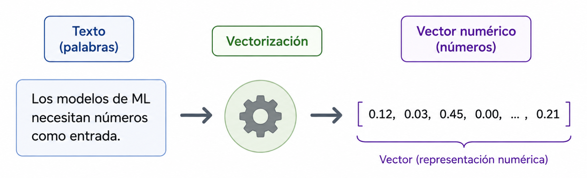
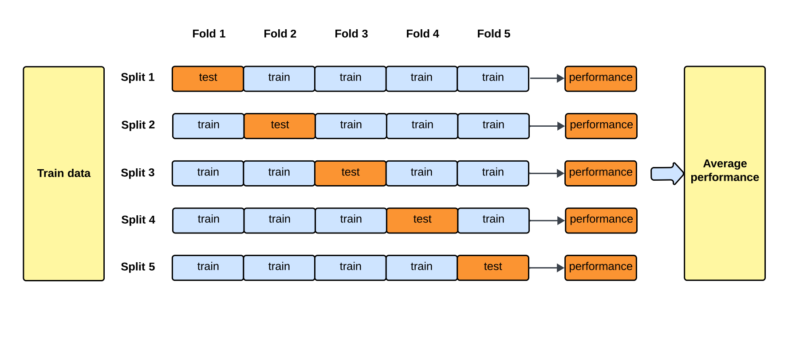

---
format:
  revealjs:
    auto-stretch: false
    margin: 0
    slide-number: true
    scrollable: false
    preview-links: auto
    page-layout: custom
    logo: imagenes/logo_portada2.png
    css: ine_quarto_styles.css

jupyter: curso-cd-ia
code-annotations: hover
---

```{python}
#| echo: false
#| output: false
import pandas as pd
import numpy as np
import matplotlib.pyplot as plt
import matplotlib
import seaborn as sns
import re
import warnings
warnings.filterwarnings('ignore')

import unicodedata
import nltk
nltk.download('stopwords', quiet=True)
from nltk.corpus import stopwords
from nltk.stem import SnowballStemmer

from sklearn.feature_extraction.text import CountVectorizer, TfidfVectorizer
from sklearn.linear_model import LogisticRegression
from sklearn.naive_bayes import MultinomialNB
from sklearn.model_selection import train_test_split, cross_val_score, StratifiedKFold
from sklearn.metrics import (classification_report, confusion_matrix,
                              ConfusionMatrixDisplay, accuracy_score,
                              precision_score, recall_score, f1_score)
from sklearn.pipeline import Pipeline

matplotlib.rcParams['figure.dpi'] = 120
```

#

[]{.center-justified}


[**Machine Learning Supervisado con Datos de Texto**]{.big-par .center-justified}

[**Área de Ciencia de Datos**]{.big-par .center-justified}

[**Unidad de Gobierno de Datos**]{.big-par .center-justified}


[**Mayo 2026**]{.big-par .center-justified}

## Temario de hoy

::: {.medium-par .incremental}
El objetivo de esta clase es construir un **pipeline completo de clasificación de texto**, desde el texto crudo hasta la evaluación del modelo.

1.  **Limpieza de textos** — preprocesamiento previo a la vectorización
2.  **Cómo convertir texto en vectores** — el problema de la representación
3.  **Enfoque clásico: Bag of Words (BOW)**
4.  **Enfoque TF-IDF**
5.  **Entrenamiento de un clasificador de texto**
6.  **Evaluación del desempeño**
:::

## Datos: Los Simpsons

::: {.medium-par}
Trabajaremos con un dataset de **diálogos de Los Simpsons**. Contiene las líneas de 4 personajes: Homero, Marge, Bart y Lisa.

-   Nuestro **objetivo**: dado un diálogo, predecir **qué personaje lo dijo**.
-   Es un problema de **clasificación multiclase supervisada** (4 clases).
:::

```{python}
#| echo: true
data = pd.read_parquet("data/data_simpsons.parquet")
print(f"Shape: {data.shape}")
print(f"Columnas: {data.columns.tolist()}")

```


{width=45%}

## Datos: Los Simpsons

::: {.medium-par}
Veamos cuántas líneas tiene cada personaje:
:::

```{python}
#| echo: true
data['raw_character_text'].value_counts()
```

::: {.fragment .medium-par}
Homero tiene casi 3 veces más líneas que Lisa. Este **desbalance de clases** será relevante al evaluar el modelo.
:::

## Datos: Los Simpsons

::: {.medium-par}
Algunos ejemplos de diálogos:
:::

```{python}
#| echo: true
for personaje in data['raw_character_text'].unique():
    ejemplo = data[data['raw_character_text'] == personaje]['spoken_words'].dropna().iloc[0]
    print(f"[{personaje}]: {ejemplo}")

```


::: {.callout-note .small-callout .bottom-note}
## Nota

Lamentablemente no pude encontrar los diálogos en español, así que tendremos que trabajar con
la versión en inglés. Más adelante mencionaremos temas de procesamiento específico del español.

:::


## Datos: preparación inicial

::: {.medium-par}
Hay filas con texto vacío. Las eliminamos antes de continuar:
:::

```{python}
#| echo: true
print(f"Filas antes: {len(data):,}")
data_filter = data.dropna(subset=['spoken_words'])
data_filter = data_filter[data_filter['spoken_words'].str.strip().astype(bool)].copy()
print(f"Filas después: {len(data_filter):,}")
print(f"Eliminadas: {len(data) - len(data_filter):,}")
```

# Limpieza de textos

## ¿Por qué limpiar el texto?

::: {.incremental .medium-par}
-   El texto crudo contiene mucho "ruido": signos de puntuación, números, mayúsculas, palabras muy frecuentes que no aportan significado
(*la, el, los, a...*).

-   Si no limpiamos, nuestra **matriz de palabras** tendrá miles de columnas irrelevantes, lo que aumenta el costo computacional y puede perjudicar al modelo.

-   La limpieza reduce la dimensionalidad y hace que las palabras que sí importan tengan más peso relativo.

-   No existe una receta única: la decisión depende del corpus y del problema.
:::

## Pasos clásicos de preprocesamiento

::: {.medium-par}
| Paso | Descripción | Ejemplo |
|---|---|---|
| Minúsculas | Unifica variantes | `Homero ` → `homero` |
| Eliminar puntuación y acentos | Quita `.,:;!?...áéó...` | `D'oh!` → `Doh` |
| Eliminar números | Quita dígitos | `Channel 6` → `Channel` |
| Eliminar stopwords | Palabras vacías | `a, la, el...` |
| Mínimo de caracteres | Descarta palabras cortas | `es` → eliminada |
| Frecuencia mínima | Descarta palabras muy raras | términos únicos → eliminados |
| **Stemming** | Reduce a raíz de la palabra | `corriendo` → `corr` |
| **Lematización** | Reduce a forma canónica | `mejor` → `bueno` |
:::

::: {.fragment .small-par}
Los dos últimos pasos son opcionales y más costosos computacionalmente. La lematización suele ser más precisa que el stemming pero requiere modelos externos (e.g., `spaCy`).
:::

## Stemming vs. Lematización

::: columns
::: {.column }
**Stemming**

::: {.small-par .incremental}
-   Recorta mecánicamente el final de la palabra para obtener su raíz.
-   Rápido y simple, pero la raíz no siempre es una palabra real.
-   En Python: `SnowballStemmer` de `nltk`.
:::

::: {.fragment .small-par}
```{python}
#| echo: true
stemmer = SnowballStemmer("spanish")

palabras = ["corriendo", "corrió", "corre", "corredor"]

[stemmer.stem(palabra) for palabra in palabras]
```
:::
:::

::: {.column }
**Lematización**

::: {.small-par .incremental}
-   Usa información morfológica para obtener la forma canónica (lemma).
-   Más precisa, pero requiere un modelo lingüístico del idioma.
-   En Python: librería `spaCy` con un modelo de idioma.
-   *No la implementaremos hoy, pero es una mejora recomendada para producción.*
:::
:::
:::

::: {.callout-note .small-callout .fragment}
## Nota

Notar que estas metodologías pueden fallar -> para "corredor" no detecta la raíz bien.

:::

## Preprocesamiento en la práctica

::: {.medium-par}
Definimos una función que aplica todo el pipeline de limpieza:
:::

```{python}
#| echo: true
stop_es = set(stopwords.words('spanish'))
stemmer_es = SnowballStemmer("spanish")

stop_en = set(stopwords.words('english'))
stemmer_en = SnowballStemmer("english")

def quitar_acentos(texto):
    texto = unicodedata.normalize('NFD', texto)
    texto = ''.join(c for c in texto if unicodedata.category(c) != 'Mn')
    return texto

def limpiar_texto(texto, stopwords, stemmer):
    texto  = texto.lower()                          # minúsculas
    # texto  = quitar_acentos(texto)                  # <1>
    texto  = re.sub(r'\d+', ' ', texto)             # eliminar números
    texto  = re.sub(r'[^\w\s]', ' ', texto)         # eliminar puntuación
    tokens = texto.split()
    tokens = [t for t in tokens if t not in stopwords and len(t) >= 3]  # stopwords + largo mínimo
    tokens = [quitar_acentos(t) for t in tokens] # <2>
    tokens = [stemmer.stem(t) for t in tokens]      # stemming
    return ' '.join(tokens)

print(limpiar_texto("hola, Homero. Cómo te encuentras en el día de hoy?",
                  stopwords=stop_es, stemmer=stemmer_es))
```

1. ¿Por qué no quitamos los acentos aquí?
2. Y los terminamos quitando aquí?

::: notes
Movimos función quitar_acentos a después de sacar stopwords, porque si no, palabras que no son
stopwords (té vs te, por ejemplo), quedan transformadas en stopwords

:::


## Preprocesamiento en la práctica

::: {.medium-par}
Aplicamos la función a todo el corpus:
:::

```{python}
#| echo: true
data_filter['texto_limpio'] = data_filter['spoken_words'].apply(limpiar_texto,
                  stopwords=stop_en, stemmer=stemmer_en) #Cambiamos a inglés

# Comparamos longitud antes y después
tokens_antes   = data_filter['spoken_words'].str.split().str.len().sum()
tokens_despues = data_filter['texto_limpio'].str.split().str.len().sum()

print(f"Tokens sin preprocesar: {tokens_antes:,}")
print(f"Tokens preprocesados:   {tokens_despues:,}")
print(f"Reducción: {(1 - tokens_despues/tokens_antes)*100:.1f}%")
```

::: {.callout-warning}
## Atención
 Cambiamos a inglés las stopwords y el stemmer, pues el dataset de Los Simpsons son los diálogos en inglés, solo tradujimos los nombres de los personajes por facilidad. 
:::


## Preprocesamiento en la práctica

::: {.medium-par}
Las palabras más frecuentes luego del preprocesamiento:
:::

:::: columns


::: {.column width="80%"}
```{python}
#| echo: true
#| output-location: column
#| classes: col3070
from collections import Counter

todas_palabras = ' '.join(data_filter['texto_limpio'])\
                      .split()
mas_comunes = Counter(todas_palabras)\
                        .most_common(15)

pd.DataFrame(mas_comunes,
columns=['término', 'frecuencia'])\
  .style.set_table_attributes('style="margin: 0"')
```
:::


::: {.column width="20%"}

::: {.callout-note .small-callout}
## Nota

Si se fijan, muchas de las palabras no son particularmente informativas. Lo tendremos presente en futuras secciones.
:::

:::

::::


# De texto a vectores

## El problema de la representación

::: {.incremental .medium-par}
-   Los modelos de ML necesitan **números** como entrada, no palabras.

-   El preprocesamiento limpia el texto, pero no lo convierte en números todavía.

-   La vectorización transforma cada documento en un **vector numérico** que puede ser la fila de una tabla.

-   Existen múltiples enfoques; ahora veremos los dos más clásicos: **BOW** y **TF-IDF**.
    - En una siguiente clase veremos una versión más poderosa: **word embeddings**
:::


::: fragment
{width=60%}
:::


::: fragment
::: concepto-box
**Flujo completo**: texto crudo → limpieza → vectorización → modelo de ML
:::
:::


# Bag of Words (BOW)

## Bag of Words: concepto

::: {.incremental .medium-par}
-   La **bolsa de palabras** (BOW) construye una tabla donde:
    -   Cada **fila** es un documento (en nuestro caso, una línea de diálogo).
    -   Cada **columna** es una palabra del vocabulario.
    -   Cada **celda** es el número de veces que esa palabra aparece en ese documento.

-   El "orden" de las palabras se pierde: solo importa la frecuencia. De ahí el nombre "bolsa".

-   Resultado: una **matriz dispersa** (*sparse matrix*) con muchos ceros.
:::

{width=45%}


## Bag of Words: ejemplo

```{python}
#| echo: true

ejemplo = [
    "Soy intelectual, muy inteligente, soy intelectual, muy inteligente. Tú no, niño",
    "El niño no es inteligente",
    "Cómete mis pantaloncillos, niño",
]
#ejemplo = ejemplo*100 # repetimos para simular un corpus más grande
vectorizer = CountVectorizer()
bow_matrix = vectorizer.fit_transform(ejemplo)

pd.DataFrame(
    bow_matrix.toarray(),
    columns=vectorizer.get_feature_names_out()
)
```

## Bag of Words: limitaciones

::: {.incremental .medium-par}
-   **Palabras frecuentes dominan**: términos como *el*, *es*, *mi* tienen conteos altísimos aunque no sean informativos (por eso aplicamos stopwords antes).

-   **No considera el contexto**: "él no es inteligente, es pillo" y "él no es pillo, es inteligente" producen el mismo vector.

-   **Alta dimensionalidad**: con miles de documentos y vocabularios extensos, la matriz puede tener decenas de miles de columnas.

-   A pesar de sus limitaciones, **BOW funciona sorprendentemente bien** en muchas tareas de clasificación de texto.
:::

# TF-IDF

## TF-IDF: motivación

::: {.incremental .medium-par}
-   En BOW, una palabra que aparece mucho en **todos** los documentos tiene un conteo alto pero aporta poco para **distinguir** entre documentos.
    - Por ejemplo, _niño_ aparece en todos los documentos -> no aporta.

-   **TF-IDF** recompensa las palabras que son frecuentes en un documento pero raras en el resto del corpus.

-   Una palabra con TF-IDF alto es "especial" para ese documento: aparece mucho ahí pero poco en los demás.
:::

## TF-IDF: fórmula

::: fragment
$$TF(t,d) = \frac{\text{veces que } t \text{ aparece en } d}{\text{total de términos en } d}$$
:::

::: fragment
$$IDF(t) = \log\left(\frac{\text{N° total de documentos}}{\text{N° de documentos que contienen } t}\right)$$
:::

::: fragment
$$TF\text{-}IDF(t,d) = TF(t,d) \times IDF(t)$$
:::

::: {.fragment .medium-par}
-   Si $t$ aparece en **todos** los documentos → $IDF \approx 0$ → el término pierde peso.
-   Si $t$ es **exclusivo** de pocos documentos → $IDF$ alto → el término gana peso.
:::

::: {.fragment .callout-warning .small-callout}
## Diferencias con sklearn
 El paquete sklearn, en su implementación base calcula una fórmula ligeramente distinta $$TF(t) = \text{veces que } t \text{ aparece en } d   ;   IDF(t) = \log\left(\frac{\text{1+ N° total de documentos}}{\text{1+ N° de documentos que contienen } t}\right)+1$$
 
 Tiene una serie de ajustes para que funcione mejor en casos límite, como divisiones por 0.
:::

::: notes


-   Si $t$ aparece en **todos** los documentos → $IDF \approx 1$ → el término $TF-IDF\approx TF$ .
-   Si $t$ es **exclusivo** de pocos documentos → $IDF$ alto → el término gana peso.


:::


<!-- ## TF-IDF: fórmula scikit-learn -->


<!-- $$TF(t,d) = \frac{\text{veces que } t \text{ aparece en } d}{\text{total de términos en } d}$$ -->


<!-- $$IDF(t) = \log\left(\frac{\text{1+ N° total de documentos}}{\text{1+ N° de documentos que contienen } t}\right)+1$$ -->


<!-- $$TF\text{-}IDF(t,d) = TF(t,d) \times IDF(t)$$ -->


<!-- ::: medium-par -->
<!-- -   Si $t$ aparece en **todos** los documentos → $IDF \approx 1$ → el término $TF-IDF\approx TF$ . -->
<!-- -   Si $t$ es **exclusivo** de pocos documentos → $IDF$ alto → el término gana peso. -->
<!-- ::: -->

## TF-IDF: implementación

```{python}
#| echo: true
#| output-location: column


tfidf_vec    = TfidfVectorizer(norm=None,
                      smooth_idf=False)
tfidf_matrix = tfidf_vec.fit_transform(ejemplo)

pd.DataFrame(
    tfidf_matrix.toarray(),
    columns=tfidf_vec.get_feature_names_out()
).round(3).T


```

::: {.fragment  .small-callout .callout-note}
## Nota

Notar cómo *niño* tiene valor 1, más bajo que palabras como *cómete* o *pantaloncillos*, que son exclusivas de un solo documento.
:::

## BOW vs. TF-IDF: ¿cuándo usar cada uno?

::: {.medium-par}
| | BOW | TF-IDF |
|---|---|---|
| **Implementación** | Muy simple | Simple (más implementaciones) |
| **Palabras comunes** | Les da mucho peso | Las penaliza |
| **Palabras distintivas** | No las destaca | Las favorece |
| **Mejor cuando...** | Corpus pequeños, palabras clave poco frecuentes | Corpus grandes, queremos discriminar por vocabulario específico |
:::

::: {.fragment .nota-box}
**Una pequeña regla práctica**: si van a probar solo uno, en la mayoría de tareas de clasificación, TF-IDF da mejores resultados que BOW puro. Si hay tiempo, vale la pena probar ambos (en cualquier caso, resultados serán similares).
:::

# Entrenamiento de un clasificador

## El pipeline completo

::: {.incremental .medium-par}
Hasta ahora sabemos preprocesar y vectorizar. Para entrenar un clasificador necesitamos:

1.  **Variable objetivo** (`y`): la etiqueta de cada documento (en nuestro caso, el personaje).
2.  **Separar en train/test**: entrenar en un conjunto y evaluar en otro distinto.
3.  **Definir el pipeline**: vectorización + modelo en una sola cadena.
4.  **Entrenar el modelo** con el set de entrenamiento.
5.  **Evaluar** en el set de test.
:::

::: {.fragment .medium-par}
Empezaremos con un caso **binario** (Homero vs. Marge) para introducir las métricas de evaluación, y luego expandiremos a los 4 personajes.
:::

## Empecemos simple: Homero vs. Marge

:::: {.columns}

::: {.column width="80%"}

::: {.medium-par}
Filtramos el dataset para quedarnos solo con dos personajes:
:::

```{python}
#| echo: true
# Eliminamos filas con texto limpio vacío
data_filter = data_filter[data_filter['texto_limpio'].str.strip().astype(bool)].copy()

# Filtramos solo Homero y Marge
data_bin = data_filter[data_filter['raw_character_text'].isin(
    ['Homero Simpson', 'Marge Simpson']
)].copy()

print(f"Diálogos Homero + Marge: {len(data_bin):,}\n")

print(data_bin['raw_character_text'].value_counts())
```


:::


::: {.column width="20%" style="display: flex; align-items: center; justify-content: center;"}

:::

::::

::: {.fragment .nota-box}
Homero tiene aproximadamente el doble de líneas que Marge (~68% vs ~32%). Un modelo que prediga **siempre** "Homero" tendría ~68% de accuracy sin haber aprendido nada.
:::

## División train/test

::: {.medium-par}
Separamos los datos manteniendo la proporción de clases (*stratified split*):
:::

```{python}
#| echo: true
X_bin = data_bin['texto_limpio']
# Mapeamos explícitamente Marge Simpson (menor incidencia) como la clase positiva (1) y Homero Simpson como la clase negativa (0)
y_bin = data_bin['raw_character_text'].map({'Homero Simpson': 0, 'Marge Simpson': 1})

X_train_bin, X_test_bin, y_train_bin, y_test_bin = train_test_split(
    X_bin, y_bin,
    test_size=0.2,
    random_state=42,
    stratify=y_bin       # mantiene proporción de clases en ambos sets
)

print(f"Train: {len(X_train_bin):,} documentos")
print(f"Test:  {len(X_test_bin):,} documentos")
print(f"\nDistribución en train:\n{y_train_bin.value_counts().rename(index={0: 'Homero Simpson', 1: 'Marge Simpson'})}")
```

## Ventaja de sklearn: el Pipeline

::: {.medium-par}
`sklearn` permite encadenar vectorización y modelo en un solo objeto. Esto resuelve automáticamente un problema importante: **el set de test usará solo el vocabulario aprendido en train**.
:::

:::: columns

::: {.column width="50%"}
::: fragment
```{python}
#| echo: true

pipeline_bin = Pipeline([
    ('vectorizer', CountVectorizer(
        min_df=10, # ignora términos que aparecen en menos de 10 docs
        ngram_range=(1,2), # unigramas y bigramas
        max_features=20000  # límite al vocabulario
    )),
    ('clf', LogisticRegression(
        max_iter=1000,
        C=1.0 # inverso de la regularización
    ))
])

```


:::
:::

::: {.column width="50%"}
::: {.fragment .concepto-box}
Con `Pipeline`, cuando llamamos `.predict(X_test)`, el vectorizador transforma el test usando el vocabulario del train. No hay riesgo de fuga de información ni errores por columnas nuevas.
:::
:::

::::

::: {.callout-note .small-callout .fragment}
## Nota sobre n-gramas

Un *n-grama* es una secuencia contigua de *n* palabras. Con `ngram_range=(1,2)` el vectorizador toma como features tanto palabras sueltas (unigramas) como pares de palabras consecutivas (bigramas). Por ejemplo, "no me gusta" genera los features `no`, `me`, `gusta`, `no me`, `me gusta`. Los bigramas capturan algo del contexto que BOW pierde (negaciones, expresiones hechas), a costa de aumentar el tamaño del vocabulario.
:::

## Validación cruzada: ¿qué es y por qué?


::: {.incremental .medium-par}
-   Hasta ahora separamos los datos en **train** (entrenar) y **test** (evaluar al final). Pero, ¿cómo elegimos hiperparámetros o comparamos modelos **sin tocar el test**?

-   La **validación cruzada (k-fold CV)** divide el set de train en *k* partes (folds):
    -   Entrena con *k-1* folds y evalúa en el restante.
    -   Repite *k* veces, rotando el fold de evaluación.
    -   Reporta el promedio (y la desviación) de las *k* métricas.

-   Ventaja: aprovecha mejor los datos y entrega una estimación **más estable** del desempeño que un único train/validation split.

-   `StratifiedKFold` mantiene la proporción de clases en cada fold (importante con clases desbalanceadas).
:::

::: {.fragment .callout-warning .small-callout}
El **test set no se toca** hasta el final. La CV se hace **dentro del train**.

Aplicar validación cruzada **aumenta en _k_ veces el tiempo de entrenamiento**
:::


## Validación cruzada: ¿qué es y por qué?





## Entrenamiento: caso binario

::: {.medium-par}
Entrenamos con validación cruzada para estimar el desempeño antes de evaluar en test:
:::

```{python}
#| echo: true
cv = StratifiedKFold(n_splits=5, shuffle=True, random_state=42)

scores_f1 = cross_val_score(
    pipeline_bin, X_train_bin, y_train_bin,
    cv=cv, scoring='f1_macro'
)

print(f"F1-macro (CV 5-fold): {scores_f1.mean():.3f} ± {scores_f1.std():.3f}")

# Entrenamos el modelo final en todos los datos de train
pipeline_bin.fit(X_train_bin, y_train_bin)
print("Modelo entrenado.")

```

# Evaluación: caso binario

## ¿Por qué no solo accuracy?

::: {.incremental .medium-par}
-   Recordemos: Homero tiene ~68% de las líneas en este subset. Un modelo que prediga **siempre** "Homero" tendría un 68% de accuracy sin haber aprendido nada.

-   Necesitamos métricas que consideren **qué tipo de error** estamos cometiendo.

-   Las métricas clave son:
    -   **Precisión**: de los que predije como Homero, ¿cuántos realmente son Homero?
    -   **Recall (Sensibilidad)**: de los que realmente son Homero, ¿cuántos identifiqué correctamente?
    -   **F1-score**: media armónica entre precisión y recall.
:::

## La matriz de confusión

::: {.medium-par}
En clasificación binaria, la matriz de confusión es una tabla 2×2 que muestra las predicciones correctas e incorrectas:
:::

```{python}
#| echo: true
#| output-location: column
y_pred_bin = pipeline_bin.predict(X_test_bin)

cm_bin = confusion_matrix(y_test_bin, y_pred_bin)
disp = ConfusionMatrixDisplay(
    confusion_matrix=cm_bin,
    display_labels=['Homero Simpson', 'Marge Simpson']
)

fig, ax = plt.subplots(figsize=(5, 4))
disp.plot(ax=ax, colorbar=False, cmap='Blues')
ax.set_title('Matriz de confusión — Homero vs. Marge')
plt.tight_layout()
plt.show()
```

## La matriz de confusión: anatomía

::: {.medium-par}
Cada celda tiene un nombre específico (tomando a Marge como la clase "positiva"):

|  | **Predicho: Homero** | **Predicho: Marge** |
|---|---|---|
| **Real: Homero** | True Negative (TN) | False Positive (FP) |
| **Real: Marge** | False Negative (FN) | True Positive (TP) |

::: {.incremental}
-   **TP** (True Positive): el modelo dijo Marge y era Marge.
-   **FP** (False Positive): el modelo dijo Marge pero era Homero .
-   **FN** (False Negative): el modelo dijo Homero pero era Marge.
-   **TN** (True Negative): el modelo dijo Homero y era Homero.
:::
:::

::: {.callout-note .small-callout .fragment}
## Nota

Notar que tradicionalmente la clase con menor frecuencia (en este caso, Marge) es tomada como la positiva, pues es la más difícil o interesante de acertar (fraude bancario, enfermedad, etc). Para tener control total y evitar confusiones con el orden alfabético por defecto de scikit-learn, mapeamos explícitamente a `'Marge Simpson'` como 1 (positiva) y a `'Homero Simpson'` como 0 (negativa).
:::

## Precisión, Recall y F1: definición

::: columns
::: {.column style="flex: 0.5"}
$$Precisión = \frac{TP}{TP + FP}$$

::: small-par
De todas las líneas que el modelo dijo que eran de *Marge*, ¿cuántas realmente las dijo Marge?

Penaliza los **falsos positivos**.
:::

$$Recall = \frac{TP}{TP + FN}$$

::: small-par
De todas las líneas que realmente dijo *Marge*, ¿cuántas identificó el modelo?

Penaliza los **falsos negativos**.
:::
:::

::: {.column style="flex: 0.5"}
$$F1 = 2 \cdot \frac{Precisión \times Recall}{Precisión + Recall}$$

::: {.small-par .incremental}
-   Es la **media armónica** entre precisión y recall.
-   Da un único número que balancea ambas métricas.
-   Útil cuando las clases están **desbalanceadas** (como en nuestro caso).
-   Un F1 = 1 es perfecto; F1 = 0 es el peor escenario.
:::
:::
:::

## Reporte de clasificación: caso binario

::: {.medium-par}
`classification_report` entrega precisión, recall y F1 para cada clase:
:::

```{python}
#| echo: true
print(classification_report(y_test_bin, y_pred_bin, target_names=['Homero Simpson', 'Marge Simpson']))
```

::: {.fragment .medium-par}
Podemos ver estas métricas **por separado para cada clase**. Esto es fundamental cuando hay desbalance: un buen resultado en Homero no garantiza un buen resultado en Marge.
:::

## BOW vs. TF-IDF: caso binario

::: {.medium-par}
Comparamos ambas estrategias de vectorización:
:::

```{python}
#| echo: true
def metricas(nombre, y_true, y_pred):
    return {
        'Modelo':     nombre,
        'Accuracy':   round(accuracy_score(y_true, y_pred), 3),
        'Precision':  round(precision_score(y_true, y_pred, average='macro'), 3),
        'Recall':     round(recall_score(y_true, y_pred, average='macro'), 3),
        'F1-macro':   round(f1_score(y_true, y_pred, average='macro'), 3)
    }

pipeline_tfidf_bin = Pipeline([
    ('vectorizer', TfidfVectorizer(min_df=10, max_features=20000, ngram_range=(1, 2))),
    ('clf', LogisticRegression(max_iter=1000, C=1.0))
])

pipeline_tfidf_bin.fit(X_train_bin, y_train_bin)
y_pred_tfidf_bin = pipeline_tfidf_bin.predict(X_test_bin)

pd.DataFrame([
    metricas("Reg. Logística — BOW",    y_test_bin, y_pred_bin),
    metricas("Reg. Logística — TF-IDF", y_test_bin, y_pred_tfidf_bin)
])
```

## ¿Qué palabras distinguen a Homero de Marge?

::: {.medium-par}
En clasificación binaria, la regresión logística tiene un solo vector de coeficientes. Las palabras con coeficiente positivo apuntan a una clase y las negativas a la otra:
:::

```{python}
#| echo: true
#| fig-height: 4
#| output-location: column

feature_names = pipeline_bin.named_steps['vectorizer'].get_feature_names_out()
coefs         = pipeline_bin.named_steps['clf'].coef_[0]

coef_df = (pd.DataFrame({'término': feature_names, 'coef': coefs})
           .assign(abs_coef=lambda df: df['coef'].abs())
           .sort_values('abs_coef', ascending=False)
           .head(20))

clase_pos = 'Marge Simpson'
clase_neg = 'Homero Simpson'
colors = ['#FF961C' if c > 0 else '#1381B0' for
              c in coef_df['coef']]

fig, ax = plt.subplots(figsize=(8, 5))
ax.barh(coef_df['término'], coef_df['coef'], 
color=colors)
ax.axvline(0, color='black', linewidth=0.8)
ax.set_xlabel('Coeficiente')
ax.set_title(f'Términos más importantes  |  \
naranja={clase_pos}, azul={clase_neg}')
plt.tight_layout()
plt.show()
```

# Expandiendo a toda la familia

## De 2 a 4 personajes

::: {.incremental .medium-par}
-   El caso binario nos permitió entender las métricas con claridad.

-   Ahora agregamos a **Bart** y **Lisa**: pasamos de clasificación binaria a **multiclase** (4 clases).

-   El pipeline es exactamente el mismo. Lo que cambia es cómo se calculan y promedian las métricas.
:::

{width=50%}

## Entrenamiento: toda la familia

```{python}
#| echo: true
X = data_filter['texto_limpio']
y = data_filter['raw_character_text']

X_train, X_test, y_train, y_test = train_test_split(
    X, y, test_size=0.2, random_state=42, stratify=y
)

print(f"Train: {len(X_train):,}  |  Test: {len(X_test):,}")
print(f"\nDistribución en train:\n{y_train.value_counts()}")
```

## Un nuevo modelo: Naive Bayes

::: {.incremental .medium-par}
-   **Naive Bayes** es un clasificador probabilístico basado en el teorema de Bayes.

-   Asume que, **dada la clase**, las palabras son **independientes entre sí** (de ahí lo de *naive*: es una simplificación irreal pero útil).

-   Para cada documento, calcula $P(\text{clase} \mid \text{palabras})$ y elige la clase más probable.

-   En texto se usa la variante **`MultinomialNB`**, que modela conteos de palabras (compatible con BOW y TF-IDF).

-   Ventajas:
    -   Muy **rápido** de entrenar, incluso con vocabularios grandes.
    -   Funciona bien con **pocos datos**.
    -   Es el **baseline clásico** en clasificación de texto: si un modelo más complejo no le gana, algo anda mal.
:::

## Entrenamiento: toda la familia

```{python}
#| echo: true
pipeline_lr = Pipeline([
    ('vectorizer', CountVectorizer(min_df=10, max_features=20000, ngram_range=(1, 2))),
    ('clf', LogisticRegression(max_iter=1000, C=1.0))
])

pipeline_nb = Pipeline([
    ('vectorizer', CountVectorizer(min_df=10, max_features=20000, ngram_range=(1, 2))),
    ('clf', MultinomialNB())
])

pipeline_lr.fit(X_train, y_train)
pipeline_nb.fit(X_train, y_train)
print("Modelos entrenados.")
```

::: {.fragment .concepto-box}
**¿Cuándo usar cada modelo?**

-   **Naive Bayes**: baseline rápido, corpora pequeños, muchas clases.
-   **Regresión Logística**: mayor poder predictivo, interpretable (los coeficientes muestran qué palabras pesan más por clase).
-   **SVM / Random Forest / XGBoost**: cuando se necesita más precisión y hay recursos computacionales disponibles.
:::

# Evaluación: caso multiclase

## Matriz de confusión: 4 personajes

::: {.medium-par}
Ahora la matriz es de 4×4. La diagonal muestra las clasificaciones correctas:
:::

```{python}
#| echo: true
#| output-location: column

y_pred_lr = pipeline_lr.predict(X_test)

cm = confusion_matrix(y_test, y_pred_lr, labels=pipeline_lr.classes_)
disp = ConfusionMatrixDisplay(
    confusion_matrix=cm,
    display_labels=['Bart', 'Homero', 'Lisa', 'Marge']
)

fig, ax = plt.subplots(figsize=(6, 5))
disp.plot(ax=ax, colorbar=False, cmap='Blues')
ax.set_title('Matriz de confusión — 4 personajes')
plt.tight_layout()
plt.show()
```

## Reporte de clasificación: 4 personajes

```{python}
#| echo: true
print(classification_report(y_test, y_pred_lr))
```

{width=40%}


::: notes
Recall alto Homero, resto bajo (modelo tiende a predecir homero)
Precision relativamente constante entre clases

:::


## Macro vs. Weighted

::: {.small-par}
En multiclase, necesitamos **promediar** las métricas por clase. Hay dos formas principales:
:::

::: {.small-par}
| Promedio | Cálculo | Cuándo usarlo |
|---|---|---|
| **macro** | Promedio simple de cada clase | Cuando **todas las clases importan igual**, independiente de su tamaño |
| **weighted** | Promedio ponderado por n° de muestras | Cuando importa más el **rendimiento global** |
:::

::: {.fragment .medium-par}
Ejemplo con nuestros datos:
:::

::: fragment
```{python}
#| echo: true
f1_mac = f1_score(y_test, y_pred_lr, average='macro')
f1_wgt = f1_score(y_test, y_pred_lr, average='weighted')

print(f"F1 macro:    {f1_mac:.3f}  (trata a Lisa igual que a Homero )")
print(f"F1 weighted: {f1_wgt:.3f}  (Homero pesa más porque tiene más líneas)")
```
:::

::: {.callout-note .small-callout}
Personalmente recomiendo macro f1: el weighted f1 tiende a ser casi igual al accuracy, por lo que no aporta mucho.
:::


## Comparación de modelos

```{python}
#| echo: true
y_pred_nb = pipeline_nb.predict(X_test)

resultados = pd.DataFrame([
    metricas("Reg. Logística (BOW)", y_test, y_pred_lr),
    metricas("Naive Bayes (BOW)",    y_test, y_pred_nb)
])

resultados
```

## Comparando BOW vs. TF-IDF

```{python}
#| echo: true
pipeline_tfidf = Pipeline([
    ('vectorizer', TfidfVectorizer(min_df=10, max_features=20000)),
    ('clf', LogisticRegression(max_iter=1000, C=1.0))
])

pipeline_tfidf.fit(X_train, y_train)
y_pred_tfidf = pipeline_tfidf.predict(X_test)

comparacion = pd.DataFrame([
    metricas("Reg. Logística — BOW",    y_test, y_pred_lr),
    metricas("Reg. Logística — TF-IDF", y_test, y_pred_tfidf)
])

comparacion
```

::: {.fragment .nota-box}
Los resultados pueden variar según el corpus. Como mencionábamos, **lo ideal es  comparar** al menos estas dos estrategias de vectorización antes de decidir.
:::

## ¿Qué palabras aprende el modelo?

::: {.medium-par}
En multiclase, la regresión logística tiene un vector de coeficientes **por cada clase**. Veamos las 10 palabras más asociadas a cada personaje:
:::

```{python}
#| echo: false
#| code-fold: true
feature_names = pipeline_lr.named_steps['vectorizer'].get_feature_names_out()
clases        = pipeline_lr.classes_

fig, axes = plt.subplots(2, 2, figsize=(6, 4))
colores = ['#FF961C', '#1381B0', '#2ca02c', '#d62728']

for idx, (clase, ax, color) in enumerate(zip(clases, axes.flat, colores)):
    coefs = pipeline_lr.named_steps['clf'].coef_[idx]
    top_idx = np.argsort(coefs)[-10:]
    ax.barh(feature_names[top_idx], coefs[top_idx], color=color)
    ax.set_title(clase, fontsize=12, fontweight='bold')
    ax.tick_params(labelsize=9)

plt.suptitle('Top 10 palabras más asociadas a cada personaje', fontsize=14)
plt.tight_layout()
plt.show()
```

## Resumen: el pipeline completo

::: {.medium-par .full-height}
```
datos de texto
    │
    ▼
[1] Limpieza          limpiar_texto():
                      lower → sin números → sin puntuación
                      → sin stopwords → stemming
    │
    ▼
[2] Vectorización     CountVectorizer()     ←── BOW
                      TfidfVectorizer()     ←── TF-IDF
    │
    ▼
[3] Train / Test      train_test_split(..., stratify=y)
    │
    ▼
[4] Pipeline          Pipeline([vectorizer, clf])
                      LogisticRegression | MultinomialNB
    │
    ▼
[5] Evaluación        classification_report()
                      → Accuracy, F1, Precision, Recall
                      confusion_matrix()
```
:::

## Extensiones a la clase

::: {.incremental .medium-par}
Algunas extensiones naturales a lo visto hoy:

-   **Más modelos**: `SVC`, `RandomForestClassifier`, `XGBClassifier` — todos compatibles con el mismo `Pipeline`.
-   **Lematización** con `spaCy` en lugar de stemming.
-   **Word embeddings** como features: reemplazar el vectorizador por representaciones densas pre-entrenadas.
    - Lo veremos en las próximas clases
-   **Ajuste de hiperparámetros**: usar `GridSearchCV` sobre el pipeline completo.
-   **Umbral de decisión**: ajustar con `predict_proba()` para optimizar precisión vs. recall según el problema.
:::

#

[]{.center-justified}

[**Machine Learning Supervisado con Datos de Texto**]{.big-par .center-justified}

[**Área de Ciencia de Datos**]{.big-par .center-justified}

[**Unidad de Gobierno de Datos**]{.big-par .center-justified}


[**Mayo 2026**]{.big-par .center-justified}
